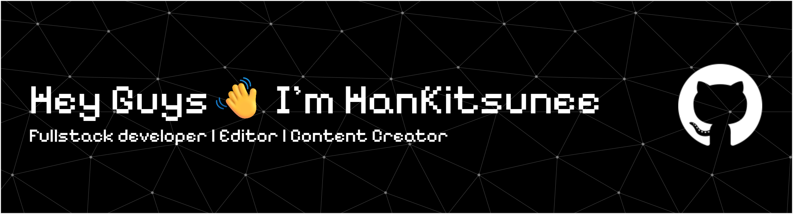

<!-- Banner Image First -->

# HanKitsunee

### Hi everyone! 👋 Welcome to my GitHub profile. Here you’ll find some of my projects and portfolios that I’ve built and shared. Feel free to explore, and if you enjoy them, don’t forget to give a star ⭐ and connect with me on social media too!
 

<!-- Sosial Media -->
# 🌐 Social Media

### You can also find me on my social media ✨

 
 

<!-- Pengalaman coding -->
# 💻 Coding Experience

### I enjoy building and experimenting with different technologies. Here are some of the languages and tools I’ve worked with:

[
 
 

<!-- Sosial Media -->
# 🖥️ Operating System

### I’ve had experience using different operating systems for coding, editing, and daily tasks:

